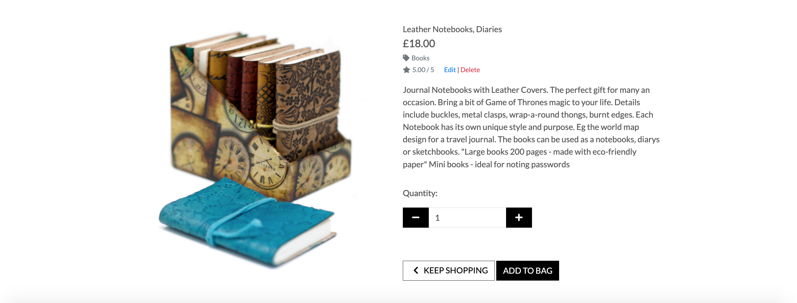
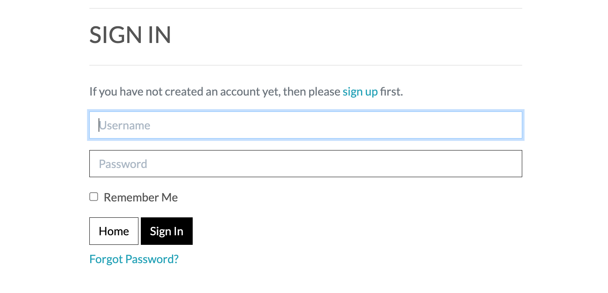

## Lola's Boutique


Welcome to Lola's boutique where you can find mindfulness inspired products available to buy. If you are a budding or experienced yogi, meditator or wellbeing enthusiast, you will find products here to inspire your day to day living and lifestyle.

This ecommerce store was built using Django and Python, deployed on Heroku.

This website provides full CRUD functionality to the admin user to add and delete products from the purposely built admin panel. Customers are able to view a history of all orders placed from their profile login.

You can view the live page [HERE](https://lolas-boutique.herokuapp.com/)


## **UX**

### **Customer Goals**

* The website has to work well on all kind of devices like mobile phones, tables and desktops.
* Visually appealing website.
* Customer should be able to easily find and buy products.
* Customer purchase should be seamless, easy and quick.
* Customer should have ability to view current and past orders.

### **Customer Stories**

* As a customer, I would like to have a quick, simple and hassle free experience during my purchase.
* As a customer, I would like to easily search for and find what I'm looking for regardless of device i'm using.
* As a customer, I would like access to a history of all my orders including current ones.
* As a customer, I would like an email confirmation that updates me on the status of my order.

### **Admin Goals**
* To have an ecommerce store that allows CRUD functions for products and customers.
* To access and update customer orders and progress.
* To enable easy access and communication to customers and viceversa.
* To have a reliable data storage system for assets and databases.

### **Customer Requirements and Expectations**

#### **Requirements**

* A simple and easy way to navigate the website and place an order.
* An easy to understand dashboard with simple controls.
* Simple display of previous and current orders.
* Receive updates on order status.
* Easy access to cancel an order or request a refund.

#### **Expectations**

* Updates on order status and view previous orders.
* Simple and hassle free finding and ordering products
* Website compatible with chosen device

### **Design Choices**
### Colours Mood board and Mockups
I have used [ColourLovers](https://www.colourlovers.com/palettes) to find inspiration for my colour palette and scheme. I went for simple muted colours to not distract from the products on display.

##### FONT CHOICE
  I chose to use a simple **Lato** font for this website to keep things simple and legible.

##### ICONS

A Favicon was added to the site. I designed the initials LB using lato font and sticking to muted colours of black and white.


##### LOGO
I have created a simple logo using **Lato** font in bold and normal to represent the purpose of the website using [Canva](https://www.canva.com/) and to maintain the consistency of fonts used throughout the site.

## Wireframes

These wireframes were created using [Balsamiq](https://balsamiq.com/) during the Scope Plane 
part of the design and planning process for this project. 

You can find my wireframes below:

### [Mobile Wireframes](docs/wireframes/Mobile-wireframes.pdf)

### [Tablet Wireframes](docs/wireframes/Tablet-wireframes.pdf)

### [Desktop Wireframes](docs/wireframes/Desktop-wireframes.pdf)

&nbsp;

# Features
## Existing Features

### Elements on the page

- __Navigation Bar__

  - Featured on all pages is a fully responsive navigation bar which includes links to the Logo, Home page, Products and their categories, a functioning search bar, accounts profile (for login, registration and order/product management), a shopping bag with products and their totals, as well as a promotion banner for delivery charges. This is identical in each page to allow for easy navigation.
  - This section will allow the user to easily navigate from page to page across all devices without having to revert back to the previous page via the ‘back’ button. 


#### Mobile Navigation


#### Desktop Navigation


- __The home page image__

  - The home page image was designed using [Canva](https://www.canva.com/). I used the branding colours and elements to represent the lifestyle of the target customer it was designed with enough space to include text overlay with a call to action.

  - This section introduces the customer to Lola's Boutique with soft colours and a call to action to grab their attention.


- __The Footer__ 

  - The footer section includes links to the relevant social media sites for Lola's Boutique. The links will open to a new tab to allow easy navigation for the user. There is an unlimited amount of social icons that can be added to the footer section via the Django admin panel.
  - There is a brief about me section to make Lola's Boutique more personable to the user.
  - The footer social links and About Me section can be easily edited using CRUD functions by the via the Django admin panel as I have created models for this section.
  - There is also a copyright section at the bottom of the footer.
  - The footer is valuable to the user as it encourages them to keep connected via social media and remain relatable to the store owner.


- __The Products__

  - The products page is fully responsive and will provide the user with images and details about each product available to buy.
  - Admin users have access to CRUD functions for each product directly on the website upon login. 
  - Users can sort products according to their prefrences using the drop down
  - Each product has a details page which gives the user more information about the product with options to choose quantity, add to bag, or keep shopping.
#### Products Page


#### Product Details Page



- __The Categories__

  - There are 2 main categories - Books & Paper and Accessories. These categories are further split into sub-categories for easier navigation and grouping of similar products
  - The categories can be found along the navigation bar and by clicking to see all products in that category, this displays links to the sub categories.
  
#### Sub Categories example


- __Sign Up__

  - A simple sign up form was created to collect email, user name and password using django's built in allauth templates. 

  - These come pre-built with Form Validations and messages to provide feedback to the user.

  - A bootstrap toast message appears if signup was successful and a user profile is created. The user is re-directed to the confirm email page.


  - Once email have been recieved and the link in the email clicked, the user is sent to the confirm email page to continue with verification.
  - Toast message appears to confirm success and user is directed to the login page.


- __Sign in__

  - A simple Sign in form was created to find user in the django database using the allauth templates complete with form validations and warnings.
  - There is a link for forgotten passwords as well as buttons to return to the home page or sign in.
  - Bootstrap toast message appears if login was successful.




- __Log Out__

  - Users can sign out easily from the profile tab. By clicking on the log out link, the user is directed to the sign out confirmation page.
  - Once the user confirms signing out, a toast message appears confirm user has been logged out and re-directed to the homepage.


- __404 Page__
  - A custom 404 page was created for when the user navigates to a link that doesn't exist.
  - I created the image with [Canva](https://www.canva.com/) by using branding colours and fonts.


#### ADMIN USER and USER Profiles

- __User Profile__


  - User profile displays current and previous order details as well as a form section to update delivery information.


- __Admin Profile__

  - The admin user has complete access to carry out CRUD functions for product management via my accounts section

  - The admin user has the edit and delete buttons that appear next to each product.


##### **CREATE**
Admin user can add a new product and upload image of product filling out the form via product management page.

##### **READ**
All logged in users have access to view products and previous orders.

##### **UPDATE**
Admin user can edit products by clicking the edit button next to each product which loads up the pre-populated form.
Standard user can update delivery information from their profile page.

Once changes have been saved, toast message displays it has been successfully updated.


##### **DELETE**
Admin user can delete products. A toast message appears confirming it has been successfully deleted and user is returned to the products page.


### **Database Structure**

I have used Django to set up the relational database. SQLite was used in the development phase and Heroku was used for live production using Postgres. These are the daatabase model created for this project: 

#### **Users:**

| Key           | Value      |
|---------------|------------|
| userID        | Autofield  |
| username      | Charfield  |
| email address | Emailfield |
| password      | Charfield  |

#### **Orders:**

| Key           | Value         |
|---------------|---------------|
| order number  | Charfield     |
| date          | DateTimeField |
| full name     | Charfield     |
| order total   | DecimalField  |
| delivery cost | DecimalField  |
| grand total   | DecimalField  |


#### HOME PAGE Footer Section

#### **Footer - About me:**

| Key  | Value     |
|------|-----------|
| bio  | TextField |


#### **Social Media:**

| Key   | Value     |
|-------|-----------|
| url   | Charfield |
| icons | Charfield |


#### PRODUCTS Section

#### **Categories:**

| Key           | Value     |
|---------------|-----------|
| name          | Charfield |
| friendly name | Charfield |

#### **Products:**

| Key      | Value        |
|----------|--------------|
| sku      | Charfield    |
| name     | Charfield    |
| category | ForeignKey   |
| price    | DecimalField |
| rating   | DecimalField |
| image    | ImageField   |


## Testing 

### Validator Testing 

- HTML
  - 6 errors were returned when passing through the official [W3C validator](https://validator.w3.org/nu/?doc=https%3A%2F%2Flolas-boutique.herokuapp.com%2F) which have all been fixed with no errors found.

  
  


- CSS
  - No errors were found when passing through the official [(Jigsaw) validator](https://jigsaw.w3.org/css-validator/validator?uri=https%3A%2F%2Flolas-boutique.herokuapp.com%2F&profile=css3svg&usermedium=all&warning=1&vextwarning=&lang=en)


SCREEN SIZES (Responsiveness)
PLACING AN ORDER
REGISTER
SIGN IN
PROFILE

## Bugs 


## **Technologies used**


### **Languages**

- [HTML](https://en.wikipedia.org/wiki/HTML)
- [CSS](https://en.wikipedia.org/wiki/Cascading_Style_Sheets)
- [JavaScript](https://en.wikipedia.org/wiki/JavaScript)
- [Python](https://www.python.org/) 

### **Libraries and Frameworks**

- [Font Awesome](https://fontawesome.com/) to provide icons for the website.
- [Bootstrap](https://getbootstrap.com/) to simplify the structure of the website and make the website responsive easily.
- [Google Fonts](https://fonts.google.com/) to style the website fonts.

### **Tools**
- [Git](https://gist.github.com/derhuerst/1b15ff4652a867391f03) to handle version control.
- [GitPod](https://www.gitpod.io/) to write my code.
- [GitHub](https://github.com/) to store and share all project code remotely.
- [Heroku](https://www.heroku.com/) to deploy my website
- [Balsamiq](https://balsamiq.com/) to create the wireframes for this project.
- [Google Lighthouse](https://web.dev/lighthouse-accessibility/) to carry out accessibility audits
- [WAVE](https://wave.webaim.org/) to carry out detailed accessibility evaluation
- [W3C HTML Validation Service](https://validator.w3.org/) to validate HTML code
- [W3C CSS Validation Service](https://jigsaw.w3.org/css-validator/) to validate CSS code
- [Am I Responsive](http://ami.responsivedesign.is/) to create the website mockups
- [Responsinator](http://www.responsinator.com/) to test device responsiveness
- [MongoDB Atlas](https://www.mongodb.com/) for database storage
- [Flask](https://flask.palletsprojects.com/en/1.1.x/) to support extensions in adding functionality to the website
- [PyMongo](https://docs.mongodb.com/drivers/pymongo/) to work with MongoDB from Python.
- [Jinja](https://jinja.palletsprojects.com/en/2.11.x/) templating language for Python.

## **Deployment**

### Local Development

I have created Lolas Boutique project using Github, from there I used [Gitpod](https://gitpod.io/) to write my code. 
Then I used commits to git followed by "git push" to my GitHub repository. 
I've deployed this project to Heroku and used "git push heroku master" to make sure my pushes to GitHub were also made to Heroku. 

This project can be ran locally by following the following steps: (
I used Gitpod for development, so the following steps will be specific to Gitpod. 
You will need to adjust them depending on your IDE. You can find more information about installing packages using pip and virtual environments [here](https://packaging.python.org/guides/installing-using-pip-and-virtual-environments/)


To clone the project: 

1. From the application's repository, click the "code" button and download the zip of the repository.
1. Access the folder in your terminal window and install the application's [required modules](https://#) using the following command:

    ```
    pip3 install -r requirements.txt

1. Sign-in or sign-up to [MongoDB](https://www.mongodb.com/) and create a new cluster
    * Within the Sandbox, click the collections button and after click Create Database (Add My Own Data) called kindergarten_days
    * Set up the following collections: users, activities, memory_album [Click here to see the exact Database Structure](#database-structure)

    * Under the Security Menu on the left, select Database Access.
    * Add a new database user, and keep the credentials secure
    * Within the Network Access option, add IP Address 0.0.0.0

1. In your IDE, create a file containing your environmental variables called env.py at the root level of the application. 
    It will need to contain the following lines and variables:
    ```
    import os

    os.environ["IP"] = "0.0.0.0"
    os.environ["PORT"] = "5000"
    os.environ["SECRET_KEY"] = "YOUR_SECRET_KEY"
    os.environ["DEBUG"] = "True"
    os.environ["MONGO_URI"] = "YOUR_MONGODB_URI"
    os.environ["MONGO_DBNAME"]= "DATABASE_NAME" 
    ```

    Please note that you will need to update the **SECRET_KEY** with your own secret key, as well as the **MONGO_URI** and **MONGO_DBNAME** variables with those provided by MongoDB.
    Tip for your SECRET_KEY, you can use a [Password Generator](https://passwordsgenerator.net/) in order to have a secure secret key. 
    I personlly recommend a length of 24 characters and exclude Symbols.
    To find your MONGO_URI, go to your clusters and click on connect. Choose connect your application and copy the link provided. 
    Don't forget to update the necessary fields like password and database name. 

    If you plan on pushing this application to a public repository, ensure that env.py is added to your .gitignore file.

1. The application can now be run locally. In your terminal, type the following command 
    ```
    python3 app.py. 
    ```
    
### To deploy your project on Heroku, use the following steps: 

To deploy this page to Heroku from its GitHub repository, the following steps were taken:

1. Create the Heroku App:
    - Select "Create new app" in Heroku.
    - Choose a name for your app and select the location.

2. Attach the Postgres database:
    - In the Resources tab, under add-ons, type in Postgres and select the Heroku Postgres option.

3. Prepare the environment and settings.py file:
    - In the Settings tab, click on Reveal Config Vars and copy the url next to DATABASE_URL.
    - In your GitPod workspace, create an env.py file in the main directory. 
    - Add the DATABASE_URL value and your chosen SECRET_KEY value to the env.py file.
    - Add the SECRET_KEY value to the Config Vars in Heroku.
    - Update the settings.py file to import the env file and add the SECRETKEY and DATABASE_URL file paths.
    - Update the Config Vars with the Cloudinary url, adding into the settings.py file also.
    - In settings.py add the following sections:
        - Cloudinary to the INSTALLED_APPS list
        - STATICFILE_STORAGE
        - STATICFILES_DIRS
        - STATIC_ROOT
        - MEDIA_URL
        - DEFAULT_FILE_STORAGE
        - TEMPLATES_DIR
        - Update DIRS in TEMPLATES with TEMPLATES_DIR
        - Update ALLOWED_HOSTS with ['app_name.heroku.com', 'localhost']

4. Store Static and Media files in Cloudinary and Deploy to Heroku:
    - Create three directories in the main directory; media, storage and templates.
    - Create a file named "Procfile" in the main directory and add the following:
        - web: gunicorn project-name.wsgi
    - Go to Deploy tab on Heroku and connect to the GitHub, then to the required recpository.
    Click on Delpoy Branch and wait for the build to load. When the build is complete, the app can be opened through Heroku.
